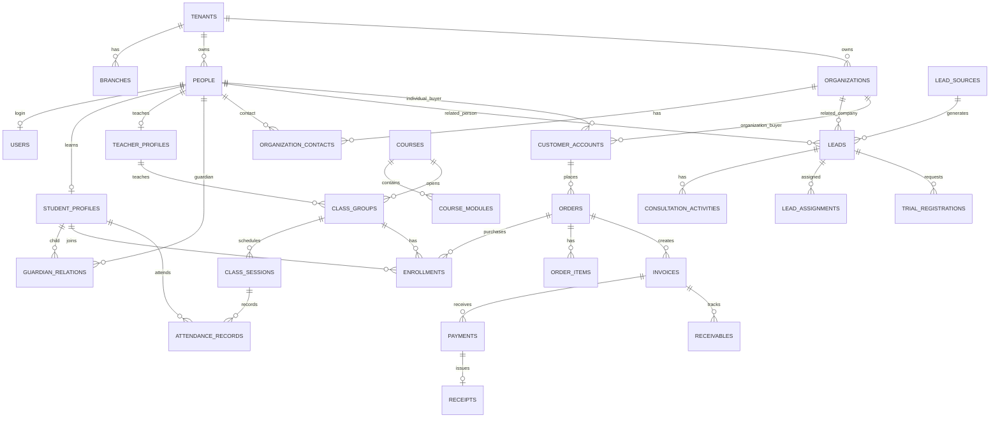

# DAYAI - Database Schema P0

Tài liệu này mô tả schema dữ liệu P0 để triển khai MVP. Mục tiêu là đủ chặt để code Laravel/Filament ngay, nhưng vẫn giữ đường mở rộng cho B2B, nhiều chi nhánh và SaaS sau này.

## 1. Nguyên Tắc Thiết Kế

- `people` là bảng lõi cho mọi cá nhân: phụ huynh, học viên, sinh viên, chủ doanh nghiệp, HR, giáo viên, nhân viên nội bộ.
- `student_profiles` là người học thực tế.
- `customer_accounts` là người mua / chủ thể thanh toán.
- `organizations` là doanh nghiệp, trường, đối tác hoặc đơn vị mua đào tạo.
- `orders`, `invoices`, `payments`, `receivables` gắn với `customer_accounts`, không gắn cứng với học viên.
- `enrollments` gắn người học với lớp/khóa.
- Một người có thể đồng thời là học viên, phụ huynh, chủ doanh nghiệp, HR hoặc giáo viên.
- Một công ty có thể mua cho nhiều nhân sự học.
- Một phụ huynh có thể mua cho nhiều con.
- P0 dùng modular monolith, nhưng dữ liệu phải có `tenant_id` và `branch_id` để không tự khóa đường scale.

## 2. Quy Ước Chung

### 2.1 Khóa Chính

- Dùng `id` dạng ULID cho tất cả bảng nghiệp vụ.
- Laravel migration đề xuất: `$table->ulid('id')->primary();`
- Lý do: dễ expose qua API hơn auto-increment, scale tốt hơn khi sau này tách service.

### 2.2 Cột Chuẩn

Các bảng nghiệp vụ nên có:

| Cột | Kiểu | Ghi chú |
|---|---|---|
| `id` | ulid | Primary key |
| `tenant_id` | ulid nullable/index | P0 có thể dùng một tenant mặc định |
| `branch_id` | ulid nullable/index | Dùng cho trung tâm/cơ sở/chi nhánh |
| `created_by_id` | ulid nullable | User tạo bản ghi |
| `updated_by_id` | ulid nullable | User cập nhật gần nhất |
| `created_at` | timestamp | Laravel timestamps |
| `updated_at` | timestamp | Laravel timestamps |
| `deleted_at` | timestamp nullable | Soft delete cho bảng cần giữ lịch sử |

Không bắt buộc `created_by_id`, `updated_by_id` cho bảng pivot hoặc bảng log chỉ append.

### 2.3 Tiền Tệ

- Dùng `bigint` cho số tiền VND.
- Tên cột: `amount_vnd`, `total_vnd`, `paid_vnd`, `balance_vnd`, `discount_vnd`.
- Không dùng float/double cho tiền.

### 2.4 Trạng Thái

- P0 dùng enum dạng string trong database để dễ đọc và dễ làm Filament filter.
- Khi scale lớn hơn có thể chuyển một số enum sang bảng cấu hình.

## 3. Sơ Đồ Quan Hệ P0

## 4. Core Identity & Organization

### 4.1 `tenants`

P0 có thể chỉ có một tenant mặc định là trung tâm DAYAI. Bảng này giúp sau này mở SaaS hoặc nhiều pháp nhân.

| Cột | Kiểu | Bắt buộc | Ghi chú |
|---|---|---:|---|
| `id` | ulid | yes | Primary key |
| `name` | varchar(255) | yes | Tên tenant |
| `code` | varchar(50) | yes | Unique, ví dụ `dayai` |
| `status` | varchar(30) | yes | `active`, `inactive` |
| `settings` | jsonb | no | Cấu hình chung |
| `created_at`, `updated_at` | timestamp | yes |  |

Index/constraint:

- unique `code`
- index `status`

### 4.2 `branches`

Chi nhánh/cơ sở của trung tâm.

| Cột | Kiểu | Bắt buộc | Ghi chú |
|---|---|---:|---|
| `id` | ulid | yes |  |
| `tenant_id` | ulid | yes | FK -> `tenants.id` |
| `name` | varchar(255) | yes | Tên cơ sở |
| `code` | varchar(50) | yes | Unique trong tenant |
| `phone` | varchar(30) | no |  |
| `email` | varchar(255) | no |  |
| `address` | text | no |  |
| `status` | varchar(30) | yes | `active`, `inactive` |
| `created_at`, `updated_at`, `deleted_at` | timestamp | yes/no |  |

Index/constraint:

- unique `tenant_id`, `code`
- index `tenant_id`, `status`

### 4.3 `people`

Bảng cá nhân lõi. Không tách phụ huynh/học viên/HR/giáo viên thành dữ liệu nhân khẩu học riêng.

| Cột | Kiểu | Bắt buộc | Ghi chú |
|---|---|---:|---|
| `id` | ulid | yes |  |
| `tenant_id` | ulid | yes | FK -> `tenants.id` |
| `branch_id` | ulid | no | FK -> `branches.id` |
| `full_name` | varchar(255) | yes |  |
| `display_name` | varchar(255) | no | Tên hiển thị |
| `gender` | varchar(20) | no | `male`, `female`, `other`, `unknown` |
| `date_of_birth` | date | no |  |
| `phone` | varchar(30) | no |  |
| `secondary_phone` | varchar(30) | no |  |
| `email` | varchar(255) | no |  |
| `address` | text | no |  |
| `province` | varchar(100) | no |  |
| `avatar_path` | varchar(500) | no |  |
| `notes` | text | no | Ghi chú nội bộ |
| `metadata` | jsonb | no | Thông tin linh hoạt |
| `created_by_id`, `updated_by_id` | ulid | no | FK -> `users.id` |
| `created_at`, `updated_at`, `deleted_at` | timestamp | yes/no |  |

Index/constraint:

- index `tenant_id`, `branch_id`
- index `phone`
- index `email`
- Gợi ý unique mềm theo tenant: không nên unique cứng phone/email vì phụ huynh có thể dùng chung số cho con; xử lý trùng bằng cảnh báo CRM.

### 4.4 `users`

Dùng bảng `users` chuẩn Laravel/Filament, liên kết về `people`.

| Cột | Kiểu | Bắt buộc | Ghi chú |
|---|---|---:|---|
| `id` | ulid | yes |  |
| `tenant_id` | ulid | yes | FK -> `tenants.id` |
| `person_id` | ulid | no | FK -> `people.id` |
| `name` | varchar(255) | yes | Tên đăng nhập/hiển thị |
| `email` | varchar(255) | yes | Unique trong tenant |
| `phone` | varchar(30) | no |  |
| `password` | varchar(255) | yes | Hash |
| `status` | varchar(30) | yes | `active`, `inactive`, `invited`, `locked` |
| `last_login_at` | timestamp | no |  |
| `email_verified_at` | timestamp | no |  |
| `remember_token` | varchar(100) | no | Laravel |
| `created_at`, `updated_at`, `deleted_at` | timestamp | yes/no |  |

Index/constraint:

- unique `tenant_id`, `email`
- index `tenant_id`, `status`
- unique nullable `person_id` nếu một người chỉ có một user trong tenant.

### 4.5 `organizations`

Công ty, trường, đối tác hoặc đơn vị mua khóa học.

| Cột | Kiểu | Bắt buộc | Ghi chú |
|---|---|---:|---|
| `id` | ulid | yes |  |
| `tenant_id` | ulid | yes | FK -> `tenants.id` |
| `branch_id` | ulid | no | FK -> `branches.id` |
| `name` | varchar(255) | yes | Tên tổ chức |
| `short_name` | varchar(100) | no |  |
| `organization_type` | varchar(50) | yes | `company`, `school`, `partner`, `internal`, `other` |
| `tax_code` | varchar(50) | no | Mã số thuế |
| `industry` | varchar(100) | no | Ngành |
| `company_size` | varchar(50) | no | `1_10`, `11_50`, `51_200`, `201_500`, `500_plus` |
| `phone` | varchar(30) | no |  |
| `email` | varchar(255) | no |  |
| `website` | varchar(255) | no |  |
| `billing_address` | text | no | Địa chỉ xuất hóa đơn |
| `address` | text | no | Địa chỉ liên hệ |
| `status` | varchar(30) | yes | `active`, `inactive`, `prospect` |
| `notes` | text | no |  |
| `metadata` | jsonb | no |  |
| `created_by_id`, `updated_by_id` | ulid | no | FK -> `users.id` |
| `created_at`, `updated_at`, `deleted_at` | timestamp | yes/no |  |

Index/constraint:

- index `tenant_id`, `organization_type`, `status`
- index `tax_code`

### 4.6 `organization_contacts`

Liên kết cá nhân với tổ chức: HR, CEO, quản lý đào tạo, nhân sự học.

| Cột | Kiểu | Bắt buộc | Ghi chú |
|---|---|---:|---|
| `id` | ulid | yes |  |
| `tenant_id` | ulid | yes | FK -> `tenants.id` |
| `organization_id` | ulid | yes | FK -> `organizations.id` |
| `person_id` | ulid | yes | FK -> `people.id` |
| `contact_role` | varchar(50) | yes | `hr`, `decision_maker`, `training_manager`, `employee`, `finance_contact`, `other` |
| `job_title` | varchar(255) | no |  |
| `department` | varchar(255) | no |  |
| `is_primary` | boolean | yes | Mặc định false |
| `status` | varchar(30) | yes | `active`, `inactive` |
| `notes` | text | no |  |
| `created_at`, `updated_at`, `deleted_at` | timestamp | yes/no |  |

Index/constraint:

- unique `organization_id`, `person_id`, `contact_role`
- index `tenant_id`, `contact_role`, `status`

### 4.7 `guardian_relations`

Quan hệ phụ huynh/người giám hộ với học viên.

| Cột | Kiểu | Bắt buộc | Ghi chú |
|---|---|---:|---|
| `id` | ulid | yes |  |
| `tenant_id` | ulid | yes | FK -> `tenants.id` |
| `guardian_person_id` | ulid | yes | FK -> `people.id` |
| `student_profile_id` | ulid | yes | FK -> `student_profiles.id` |
| `relation_type` | varchar(50) | yes | `father`, `mother`, `guardian`, `relative`, `other` |
| `is_primary` | boolean | yes | Người liên hệ chính |
| `can_view_finance` | boolean | yes | Mặc định true |
| `can_view_progress` | boolean | yes | Mặc định true |
| `can_receive_notifications` | boolean | yes | Mặc định true |
| `notes` | text | no |  |
| `created_at`, `updated_at`, `deleted_at` | timestamp | yes/no |  |

Index/constraint:

- unique `guardian_person_id`, `student_profile_id`
- index `tenant_id`, `student_profile_id`

## 5. CRM Tuyển Sinh

### 5.1 `lead_sources`

Nguồn khách.

| Cột | Kiểu | Bắt buộc | Ghi chú |
|---|---|---:|---|
| `id` | ulid | yes |  |
| `tenant_id` | ulid | yes | FK -> `tenants.id` |
| `name` | varchar(255) | yes | Ví dụ Facebook, Website, Referral |
| `code` | varchar(80) | yes | Unique trong tenant |
| `source_type` | varchar(50) | yes | `website`, `facebook`, `tiktok`, `zalo`, `referral`, `event`, `chatbot`, `manual`, `other` |
| `is_active` | boolean | yes |  |
| `created_at`, `updated_at`, `deleted_at` | timestamp | yes/no |  |

Index/constraint:

- unique `tenant_id`, `code`
- index `tenant_id`, `source_type`, `is_active`

### 5.2 `campaigns`

Chiến dịch tuyển sinh/marketing.

| Cột | Kiểu | Bắt buộc | Ghi chú |
|---|---|---:|---|
| `id` | ulid | yes |  |
| `tenant_id` | ulid | yes | FK -> `tenants.id` |
| `name` | varchar(255) | yes |  |
| `code` | varchar(80) | no |  |
| `channel` | varchar(80) | no |  |
| `start_date` | date | no |  |
| `end_date` | date | no |  |
| `budget_vnd` | bigint | no |  |
| `status` | varchar(30) | yes | `draft`, `active`, `paused`, `completed` |
| `created_at`, `updated_at`, `deleted_at` | timestamp | yes/no |  |

Index/constraint:

- index `tenant_id`, `status`, `start_date`

### 5.3 `leads`

Khách tiềm năng. Có thể chưa có `person_id` hoặc `organization_id` khi mới vào từ form.

| Cột | Kiểu | Bắt buộc | Ghi chú |
|---|---|---:|---|
| `id` | ulid | yes |  |
| `tenant_id` | ulid | yes | FK -> `tenants.id` |
| `branch_id` | ulid | no | FK -> `branches.id` |
| `lead_source_id` | ulid | no | FK -> `lead_sources.id` |
| `campaign_id` | ulid | no | FK -> `campaigns.id` |
| `person_id` | ulid | no | FK -> `people.id` nếu đã gắn cá nhân |
| `organization_id` | ulid | no | FK -> `organizations.id` nếu lead công ty |
| `assigned_user_id` | ulid | no | Tư vấn viên hiện tại |
| `lead_type` | varchar(50) | yes | `parent`, `student`, `business_owner`, `company`, `unknown` |
| `status` | varchar(50) | yes | `new`, `contacting`, `consulting`, `trial_scheduled`, `registered`, `not_fit`, `lost`, `duplicate` |
| `priority` | varchar(30) | yes | `low`, `normal`, `high`, `urgent` |
| `full_name` | varchar(255) | yes | Snapshot từ form |
| `phone` | varchar(30) | no | Snapshot |
| `email` | varchar(255) | no | Snapshot |
| `company_name` | varchar(255) | no | Snapshot nếu B2B |
| `interested_course_id` | ulid | no | FK -> `courses.id` |
| `learning_goal` | text | no | Mục tiêu học |
| `message` | text | no | Nội dung form/nhu cầu |
| `preferred_contact_method` | varchar(50) | no | `phone`, `zalo`, `email`, `messenger`, `other` |
| `preferred_time` | varchar(255) | no | Thời gian muốn được gọi |
| `utm_source` | varchar(255) | no |  |
| `utm_medium` | varchar(255) | no |  |
| `utm_campaign` | varchar(255) | no |  |
| `utm_content` | varchar(255) | no |  |
| `utm_term` | varchar(255) | no |  |
| `last_contacted_at` | timestamp | no |  |
| `next_follow_up_at` | timestamp | no |  |
| `converted_at` | timestamp | no | Khi chuyển thành customer/student |
| `lost_reason` | text | no |  |
| `metadata` | jsonb | no | Payload từ form/chatbot |
| `created_by_id`, `updated_by_id` | ulid | no | FK -> `users.id` |
| `created_at`, `updated_at`, `deleted_at` | timestamp | yes/no |  |

Index/constraint:

- index `tenant_id`, `status`, `lead_type`
- index `assigned_user_id`, `next_follow_up_at`
- index `phone`
- index `email`
- index `created_at`

### 5.4 `lead_assignments`

Lịch sử phân công lead.

| Cột | Kiểu | Bắt buộc | Ghi chú |
|---|---|---:|---|
| `id` | ulid | yes |  |
| `tenant_id` | ulid | yes | FK -> `tenants.id` |
| `lead_id` | ulid | yes | FK -> `leads.id` |
| `assigned_to_user_id` | ulid | yes | FK -> `users.id` |
| `assigned_by_user_id` | ulid | no | FK -> `users.id` |
| `assigned_at` | timestamp | yes |  |
| `unassigned_at` | timestamp | no |  |
| `reason` | varchar(255) | no |  |
| `created_at`, `updated_at` | timestamp | yes |  |

Index/constraint:

- index `lead_id`, `assigned_at`
- index `assigned_to_user_id`

### 5.5 `consultation_activities`

Lịch sử tư vấn/chăm sóc.

| Cột | Kiểu | Bắt buộc | Ghi chú |
|---|---|---:|---|
| `id` | ulid | yes |  |
| `tenant_id` | ulid | yes | FK -> `tenants.id` |
| `lead_id` | ulid | no | FK -> `leads.id` |
| `person_id` | ulid | no | FK -> `people.id` |
| `organization_id` | ulid | no | FK -> `organizations.id` |
| `activity_type` | varchar(50) | yes | `call`, `zalo`, `email`, `meeting`, `note`, `trial`, `other` |
| `direction` | varchar(20) | no | `inbound`, `outbound`, `internal` |
| `subject` | varchar(255) | no |  |
| `content` | text | yes | Ghi chú tư vấn |
| `outcome` | varchar(80) | no | `interested`, `need_follow_up`, `trial_booked`, `registered`, `not_interested`, `no_answer` |
| `activity_at` | timestamp | yes | Thời điểm xảy ra |
| `next_follow_up_at` | timestamp | no |  |
| `created_by_id` | ulid | yes | FK -> `users.id` |
| `created_at`, `updated_at`, `deleted_at` | timestamp | yes/no |  |

Index/constraint:

- index `lead_id`, `activity_at`
- index `person_id`, `activity_at`
- index `organization_id`, `activity_at`
- index `created_by_id`

### 5.6 `trial_registrations`

Đăng ký học thử.

| Cột | Kiểu | Bắt buộc | Ghi chú |
|---|---|---:|---|
| `id` | ulid | yes |  |
| `tenant_id` | ulid | yes | FK -> `tenants.id` |
| `lead_id` | ulid | no | FK -> `leads.id` |
| `person_id` | ulid | no | Người đăng ký |
| `student_profile_id` | ulid | no | Nếu đã có học viên |
| `course_id` | ulid | no | Khóa quan tâm |
| `preferred_date` | date | no |  |
| `preferred_time` | varchar(100) | no |  |
| `scheduled_session_id` | ulid | no | FK -> `class_sessions.id` nếu gắn buổi cụ thể |
| `status` | varchar(50) | yes | `requested`, `scheduled`, `attended`, `no_show`, `cancelled`, `converted` |
| `notes` | text | no |  |
| `created_by_id`, `updated_by_id` | ulid | no |  |
| `created_at`, `updated_at`, `deleted_at` | timestamp | yes/no |  |

Index/constraint:

- index `tenant_id`, `status`, `preferred_date`
- index `lead_id`

## 6. Learning Core

### 6.1 `student_profiles`

Hồ sơ người học thực tế.

| Cột | Kiểu | Bắt buộc | Ghi chú |
|---|---|---:|---|
| `id` | ulid | yes |  |
| `tenant_id` | ulid | yes | FK -> `tenants.id` |
| `branch_id` | ulid | no | FK -> `branches.id` |
| `person_id` | ulid | yes | FK -> `people.id` |
| `student_code` | varchar(50) | yes | Unique trong tenant |
| `student_type` | varchar(50) | yes | `child`, `university_student`, `working_professional`, `business_owner`, `company_employee` |
| `current_school` | varchar(255) | no | Với học sinh/sinh viên |
| `current_company` | varchar(255) | no | Snapshot nếu người đi làm |
| `job_title` | varchar(255) | no |  |
| `organization_id` | ulid | no | FK -> `organizations.id` nếu là nhân sự công ty |
| `learning_goal` | text | no | Mục tiêu học |
| `entry_level` | varchar(50) | no | `beginner`, `basic`, `intermediate`, `advanced` |
| `status` | varchar(50) | yes | `active`, `inactive`, `alumni`, `paused` |
| `notes` | text | no |  |
| `metadata` | jsonb | no |  |
| `created_by_id`, `updated_by_id` | ulid | no |  |
| `created_at`, `updated_at`, `deleted_at` | timestamp | yes/no |  |

Index/constraint:

- unique `tenant_id`, `student_code`
- unique `tenant_id`, `person_id`
- index `tenant_id`, `student_type`, `status`
- index `organization_id`

### 6.2 `teacher_profiles`

Hồ sơ giáo viên/mentor.

| Cột | Kiểu | Bắt buộc | Ghi chú |
|---|---|---:|---|
| `id` | ulid | yes |  |
| `tenant_id` | ulid | yes | FK -> `tenants.id` |
| `person_id` | ulid | yes | FK -> `people.id` |
| `teacher_code` | varchar(50) | yes | Unique trong tenant |
| `title` | varchar(255) | no | Ví dụ AI Mentor |
| `bio` | text | no |  |
| `expertise` | jsonb | no | Danh sách chuyên môn |
| `status` | varchar(50) | yes | `active`, `inactive` |
| `created_at`, `updated_at`, `deleted_at` | timestamp | yes/no |  |

Index/constraint:

- unique `tenant_id`, `teacher_code`
- unique `tenant_id`, `person_id`

### 6.3 `courses`

Khóa học.

| Cột | Kiểu | Bắt buộc | Ghi chú |
|---|---|---:|---|
| `id` | ulid | yes |  |
| `tenant_id` | ulid | yes | FK -> `tenants.id` |
| `title` | varchar(255) | yes |  |
| `slug` | varchar(255) | yes | URL landing page |
| `course_code` | varchar(50) | yes |  |
| `audience_type` | varchar(50) | yes | `children`, `students`, `business_owners`, `companies`, `mixed` |
| `level` | varchar(50) | yes | `beginner`, `intermediate`, `advanced` |
| `short_description` | text | no |  |
| `description` | text | no |  |
| `outcomes` | jsonb | no | Kết quả đầu ra |
| `duration_hours` | integer | no | Tổng giờ học |
| `session_count` | integer | no | Số buổi |
| `default_price_vnd` | bigint | no | Giá niêm yết |
| `thumbnail_path` | varchar(500) | no |  |
| `status` | varchar(50) | yes | `draft`, `published`, `archived` |
| `published_at` | timestamp | no |  |
| `created_by_id`, `updated_by_id` | ulid | no |  |
| `created_at`, `updated_at`, `deleted_at` | timestamp | yes/no |  |

Index/constraint:

- unique `tenant_id`, `slug`
- unique `tenant_id`, `course_code`
- index `tenant_id`, `audience_type`, `status`

### 6.4 `course_modules`

Module/buổi học mẫu trong khóa.

| Cột | Kiểu | Bắt buộc | Ghi chú |
|---|---|---:|---|
| `id` | ulid | yes |  |
| `tenant_id` | ulid | yes | FK -> `tenants.id` |
| `course_id` | ulid | yes | FK -> `courses.id` |
| `sort_order` | integer | yes |  |
| `title` | varchar(255) | yes |  |
| `description` | text | no |  |
| `duration_minutes` | integer | no |  |
| `learning_objectives` | jsonb | no |  |
| `created_at`, `updated_at`, `deleted_at` | timestamp | yes/no |  |

Index/constraint:

- unique `course_id`, `sort_order`
- index `course_id`

### 6.5 `class_groups`

Lớp học cụ thể.

| Cột | Kiểu | Bắt buộc | Ghi chú |
|---|---|---:|---|
| `id` | ulid | yes |  |
| `tenant_id` | ulid | yes | FK -> `tenants.id` |
| `branch_id` | ulid | no | FK -> `branches.id` |
| `course_id` | ulid | yes | FK -> `courses.id` |
| `teacher_profile_id` | ulid | no | FK -> `teacher_profiles.id` |
| `class_code` | varchar(50) | yes | Unique trong tenant |
| `name` | varchar(255) | yes |  |
| `learning_format` | varchar(50) | yes | `offline`, `online`, `hybrid`, `in_company` |
| `start_date` | date | no |  |
| `end_date` | date | no |  |
| `max_students` | integer | no |  |
| `status` | varchar(50) | yes | `planned`, `enrolling`, `active`, `completed`, `paused`, `cancelled` |
| `schedule_note` | text | no | Ví dụ T2-T4 19:30 |
| `location` | varchar(255) | no | Phòng học/link online |
| `organization_id` | ulid | no | Nếu lớp riêng cho công ty |
| `created_by_id`, `updated_by_id` | ulid | no |  |
| `created_at`, `updated_at`, `deleted_at` | timestamp | yes/no |  |

Index/constraint:

- unique `tenant_id`, `class_code`
- index `course_id`, `status`
- index `teacher_profile_id`
- index `organization_id`

### 6.6 `class_sessions`

Từng buổi học.

| Cột | Kiểu | Bắt buộc | Ghi chú |
|---|---|---:|---|
| `id` | ulid | yes |  |
| `tenant_id` | ulid | yes | FK -> `tenants.id` |
| `class_group_id` | ulid | yes | FK -> `class_groups.id` |
| `course_module_id` | ulid | no | FK -> `course_modules.id` |
| `teacher_profile_id` | ulid | no | Có thể khác giáo viên chính |
| `session_no` | integer | yes | Số buổi |
| `title` | varchar(255) | no |  |
| `starts_at` | timestamp | yes |  |
| `ends_at` | timestamp | yes |  |
| `location` | varchar(255) | no |  |
| `meeting_url` | varchar(500) | no |  |
| `status` | varchar(50) | yes | `scheduled`, `completed`, `cancelled`, `rescheduled` |
| `notes` | text | no |  |
| `created_at`, `updated_at`, `deleted_at` | timestamp | yes/no |  |

Index/constraint:

- unique `class_group_id`, `session_no`
- index `class_group_id`, `starts_at`
- index `teacher_profile_id`, `starts_at`

### 6.7 `enrollments`

Học viên tham gia lớp/khóa.

| Cột | Kiểu | Bắt buộc | Ghi chú |
|---|---|---:|---|
| `id` | ulid | yes |  |
| `tenant_id` | ulid | yes | FK -> `tenants.id` |
| `student_profile_id` | ulid | yes | FK -> `student_profiles.id` |
| `course_id` | ulid | yes | FK -> `courses.id` |
| `class_group_id` | ulid | no | FK -> `class_groups.id` |
| `order_id` | ulid | no | FK -> `orders.id` |
| `enrollment_code` | varchar(50) | yes | Unique trong tenant |
| `status` | varchar(50) | yes | `pending`, `active`, `completed`, `paused`, `cancelled`, `transferred` |
| `enrolled_at` | timestamp | yes |  |
| `started_at` | timestamp | no |  |
| `completed_at` | timestamp | no |  |
| `cancelled_at` | timestamp | no |  |
| `completion_percent` | numeric(5,2) | no | 0-100 |
| `notes` | text | no |  |
| `created_by_id`, `updated_by_id` | ulid | no |  |
| `created_at`, `updated_at`, `deleted_at` | timestamp | yes/no |  |

Index/constraint:

- unique `tenant_id`, `enrollment_code`
- index `student_profile_id`, `status`
- index `class_group_id`, `status`
- index `order_id`

### 6.8 `attendance_records`

Điểm danh theo buổi học.

| Cột | Kiểu | Bắt buộc | Ghi chú |
|---|---|---:|---|
| `id` | ulid | yes |  |
| `tenant_id` | ulid | yes | FK -> `tenants.id` |
| `class_session_id` | ulid | yes | FK -> `class_sessions.id` |
| `student_profile_id` | ulid | yes | FK -> `student_profiles.id` |
| `enrollment_id` | ulid | no | FK -> `enrollments.id` |
| `status` | varchar(50) | yes | `present`, `absent`, `late`, `excused`, `makeup` |
| `checked_in_at` | timestamp | no |  |
| `minutes_late` | integer | no |  |
| `absence_reason` | text | no |  |
| `teacher_note` | text | no |  |
| `recorded_by_id` | ulid | no | FK -> `users.id` |
| `created_at`, `updated_at`, `deleted_at` | timestamp | yes/no |  |

Index/constraint:

- unique `class_session_id`, `student_profile_id`
- index `student_profile_id`, `status`
- index `enrollment_id`

### 6.9 `makeup_sessions`

Học bù thủ công.

| Cột | Kiểu | Bắt buộc | Ghi chú |
|---|---|---:|---|
| `id` | ulid | yes |  |
| `tenant_id` | ulid | yes | FK -> `tenants.id` |
| `student_profile_id` | ulid | yes | FK -> `student_profiles.id` |
| `original_session_id` | ulid | no | FK -> `class_sessions.id` |
| `makeup_session_id` | ulid | no | FK -> `class_sessions.id` |
| `status` | varchar(50) | yes | `requested`, `scheduled`, `completed`, `cancelled` |
| `reason` | text | no |  |
| `scheduled_by_id` | ulid | no | FK -> `users.id` |
| `created_at`, `updated_at`, `deleted_at` | timestamp | yes/no |  |

Index/constraint:

- index `student_profile_id`, `status`
- index `original_session_id`
- index `makeup_session_id`

## 7. Finance MVP

### 7.1 `customer_accounts`

Người mua/chủ thể thanh toán. Đây là lớp chống nhầm giữa người mua và người học.

| Cột | Kiểu | Bắt buộc | Ghi chú |
|---|---|---:|---|
| `id` | ulid | yes |  |
| `tenant_id` | ulid | yes | FK -> `tenants.id` |
| `branch_id` | ulid | no | FK -> `branches.id` |
| `account_type` | varchar(50) | yes | `individual`, `organization` |
| `person_id` | ulid | no | FK -> `people.id`, nếu cá nhân mua |
| `organization_id` | ulid | no | FK -> `organizations.id`, nếu công ty mua |
| `account_code` | varchar(50) | yes | Unique trong tenant |
| `display_name` | varchar(255) | yes | Snapshot tên người mua |
| `billing_name` | varchar(255) | no | Tên xuất phiếu/hóa đơn |
| `billing_tax_code` | varchar(50) | no |  |
| `billing_email` | varchar(255) | no |  |
| `billing_phone` | varchar(30) | no |  |
| `billing_address` | text | no |  |
| `status` | varchar(50) | yes | `active`, `inactive` |
| `notes` | text | no |  |
| `created_by_id`, `updated_by_id` | ulid | no |  |
| `created_at`, `updated_at`, `deleted_at` | timestamp | yes/no |  |

Index/constraint:

- unique `tenant_id`, `account_code`
- index `tenant_id`, `account_type`, `status`
- Check logic cấp app: nếu `account_type = individual` thì có `person_id`; nếu `organization` thì có `organization_id`.

### 7.2 `training_contracts`

Hợp đồng đào tạo B2B. P0 chỉ cần thông tin cơ bản.

| Cột | Kiểu | Bắt buộc | Ghi chú |
|---|---|---:|---|
| `id` | ulid | yes |  |
| `tenant_id` | ulid | yes | FK -> `tenants.id` |
| `organization_id` | ulid | yes | FK -> `organizations.id` |
| `customer_account_id` | ulid | no | FK -> `customer_accounts.id` |
| `contract_code` | varchar(80) | yes | Unique trong tenant |
| `title` | varchar(255) | yes |  |
| `signed_date` | date | no |  |
| `start_date` | date | no |  |
| `end_date` | date | no |  |
| `total_value_vnd` | bigint | no |  |
| `status` | varchar(50) | yes | `draft`, `sent`, `signed`, `active`, `completed`, `cancelled` |
| `file_path` | varchar(500) | no | File hợp đồng |
| `notes` | text | no |  |
| `created_by_id`, `updated_by_id` | ulid | no |  |
| `created_at`, `updated_at`, `deleted_at` | timestamp | yes/no |  |

Index/constraint:

- unique `tenant_id`, `contract_code`
- index `organization_id`, `status`

### 7.3 `orders`

Đơn đăng ký/mua khóa học.

| Cột | Kiểu | Bắt buộc | Ghi chú |
|---|---|---:|---|
| `id` | ulid | yes |  |
| `tenant_id` | ulid | yes | FK -> `tenants.id` |
| `branch_id` | ulid | no | FK -> `branches.id` |
| `customer_account_id` | ulid | yes | FK -> `customer_accounts.id` |
| `training_contract_id` | ulid | no | FK -> `training_contracts.id` nếu B2B |
| `lead_id` | ulid | no | FK -> `leads.id` |
| `order_code` | varchar(80) | yes | Unique trong tenant |
| `order_type` | varchar(50) | yes | `b2c`, `b2b`, `trial_to_paid`, `renewal` |
| `status` | varchar(50) | yes | `draft`, `confirmed`, `partially_paid`, `paid`, `cancelled`, `refunded` |
| `ordered_at` | timestamp | yes |  |
| `subtotal_vnd` | bigint | yes |  |
| `discount_vnd` | bigint | yes | Mặc định 0 |
| `total_vnd` | bigint | yes |  |
| `paid_vnd` | bigint | yes | Denormalized để xem nhanh |
| `balance_vnd` | bigint | yes | Denormalized |
| `payment_due_date` | date | no |  |
| `sales_user_id` | ulid | no | Tư vấn viên chốt đơn |
| `notes` | text | no |  |
| `created_by_id`, `updated_by_id` | ulid | no |  |
| `created_at`, `updated_at`, `deleted_at` | timestamp | yes/no |  |

Index/constraint:

- unique `tenant_id`, `order_code`
- index `customer_account_id`, `status`
- index `training_contract_id`
- index `sales_user_id`
- index `ordered_at`

### 7.4 `order_items`

Dòng hàng trong đơn.

| Cột | Kiểu | Bắt buộc | Ghi chú |
|---|---|---:|---|
| `id` | ulid | yes |  |
| `tenant_id` | ulid | yes | FK -> `tenants.id` |
| `order_id` | ulid | yes | FK -> `orders.id` |
| `course_id` | ulid | yes | FK -> `courses.id` |
| `class_group_id` | ulid | no | FK -> `class_groups.id` nếu đã biết lớp |
| `student_profile_id` | ulid | no | Nếu dòng này mua cho học viên cụ thể |
| `description` | varchar(255) | yes | Snapshot tên khóa/gói |
| `quantity` | integer | yes |  |
| `unit_price_vnd` | bigint | yes |  |
| `discount_vnd` | bigint | yes | Mặc định 0 |
| `total_vnd` | bigint | yes |  |
| `created_at`, `updated_at`, `deleted_at` | timestamp | yes/no |  |

Index/constraint:

- index `order_id`
- index `course_id`
- index `student_profile_id`

### 7.5 `invoices`

Yêu cầu thanh toán / hóa đơn nội bộ.

| Cột | Kiểu | Bắt buộc | Ghi chú |
|---|---|---:|---|
| `id` | ulid | yes |  |
| `tenant_id` | ulid | yes | FK -> `tenants.id` |
| `order_id` | ulid | yes | FK -> `orders.id` |
| `customer_account_id` | ulid | yes | FK -> `customer_accounts.id` |
| `invoice_code` | varchar(80) | yes | Unique trong tenant |
| `status` | varchar(50) | yes | `draft`, `issued`, `partially_paid`, `paid`, `overdue`, `cancelled` |
| `issued_at` | timestamp | no |  |
| `due_date` | date | no |  |
| `amount_vnd` | bigint | yes |  |
| `paid_vnd` | bigint | yes |  |
| `balance_vnd` | bigint | yes |  |
| `notes` | text | no |  |
| `created_by_id`, `updated_by_id` | ulid | no |  |
| `created_at`, `updated_at`, `deleted_at` | timestamp | yes/no |  |

Index/constraint:

- unique `tenant_id`, `invoice_code`
- index `order_id`
- index `customer_account_id`, `status`
- index `due_date`

### 7.6 `payments`

Giao dịch thanh toán.

| Cột | Kiểu | Bắt buộc | Ghi chú |
|---|---|---:|---|
| `id` | ulid | yes |  |
| `tenant_id` | ulid | yes | FK -> `tenants.id` |
| `invoice_id` | ulid | yes | FK -> `invoices.id` |
| `order_id` | ulid | yes | FK -> `orders.id` |
| `customer_account_id` | ulid | yes | FK -> `customer_accounts.id` |
| `payment_code` | varchar(80) | yes | Unique trong tenant |
| `payment_method` | varchar(50) | yes | `cash`, `bank_transfer`, `card`, `momo`, `vnpay`, `other` |
| `status` | varchar(50) | yes | `pending`, `completed`, `failed`, `refunded`, `cancelled` |
| `amount_vnd` | bigint | yes |  |
| `paid_at` | timestamp | yes |  |
| `bank_reference` | varchar(255) | no | Mã giao dịch |
| `received_by_id` | ulid | no | FK -> `users.id` |
| `notes` | text | no |  |
| `created_at`, `updated_at`, `deleted_at` | timestamp | yes/no |  |

Index/constraint:

- unique `tenant_id`, `payment_code`
- index `invoice_id`
- index `order_id`
- index `customer_account_id`, `paid_at`
- index `status`

### 7.7 `receivables`

Công nợ. Có thể tạo một bản ghi theo invoice, hoặc theo kỳ nếu sau này chia kỳ.

| Cột | Kiểu | Bắt buộc | Ghi chú |
|---|---|---:|---|
| `id` | ulid | yes |  |
| `tenant_id` | ulid | yes | FK -> `tenants.id` |
| `invoice_id` | ulid | yes | FK -> `invoices.id` |
| `customer_account_id` | ulid | yes | FK -> `customer_accounts.id` |
| `status` | varchar(50) | yes | `open`, `partially_paid`, `paid`, `overdue`, `written_off` |
| `original_amount_vnd` | bigint | yes |  |
| `paid_vnd` | bigint | yes |  |
| `balance_vnd` | bigint | yes |  |
| `due_date` | date | no |  |
| `last_reminded_at` | timestamp | no |  |
| `notes` | text | no |  |
| `created_at`, `updated_at`, `deleted_at` | timestamp | yes/no |  |

Index/constraint:

- index `customer_account_id`, `status`
- index `due_date`, `status`
- index `invoice_id`

### 7.8 `receipts`

Phiếu thu.

| Cột | Kiểu | Bắt buộc | Ghi chú |
|---|---|---:|---|
| `id` | ulid | yes |  |
| `tenant_id` | ulid | yes | FK -> `tenants.id` |
| `payment_id` | ulid | yes | FK -> `payments.id` |
| `receipt_code` | varchar(80) | yes | Unique trong tenant |
| `issued_at` | timestamp | yes |  |
| `issued_by_id` | ulid | no | FK -> `users.id` |
| `payer_name` | varchar(255) | yes | Snapshot |
| `amount_vnd` | bigint | yes |  |
| `content` | text | no | Nội dung thu |
| `file_path` | varchar(500) | no | PDF nếu xuất file |
| `created_at`, `updated_at`, `deleted_at` | timestamp | yes/no |  |

Index/constraint:

- unique `tenant_id`, `receipt_code`
- unique `payment_id`
- index `issued_at`

## 8. CMS Public Website P0

### 8.1 `cms_pages`

Trang tĩnh cơ bản: giới thiệu, liên hệ, chính sách.

| Cột | Kiểu | Bắt buộc | Ghi chú |
|---|---|---:|---|
| `id` | ulid | yes |  |
| `tenant_id` | ulid | yes | FK -> `tenants.id` |
| `title` | varchar(255) | yes |  |
| `slug` | varchar(255) | yes |  |
| `page_type` | varchar(50) | yes | `home`, `about`, `contact`, `policy`, `custom` |
| `content` | text | no | HTML/Markdown tùy triển khai |
| `seo_title` | varchar(255) | no |  |
| `seo_description` | text | no |  |
| `status` | varchar(50) | yes | `draft`, `published`, `archived` |
| `published_at` | timestamp | no |  |
| `created_by_id`, `updated_by_id` | ulid | no |  |
| `created_at`, `updated_at`, `deleted_at` | timestamp | yes/no |  |

Index/constraint:

- unique `tenant_id`, `slug`
- index `tenant_id`, `page_type`, `status`

### 8.2 `news_posts`

Tin tức/bài viết.

| Cột | Kiểu | Bắt buộc | Ghi chú |
|---|---|---:|---|
| `id` | ulid | yes |  |
| `tenant_id` | ulid | yes | FK -> `tenants.id` |
| `title` | varchar(255) | yes |  |
| `slug` | varchar(255) | yes |  |
| `excerpt` | text | no |  |
| `content` | text | no |  |
| `thumbnail_path` | varchar(500) | no |  |
| `status` | varchar(50) | yes | `draft`, `published`, `archived` |
| `published_at` | timestamp | no |  |
| `created_by_id`, `updated_by_id` | ulid | no |  |
| `created_at`, `updated_at`, `deleted_at` | timestamp | yes/no |  |

Index/constraint:

- unique `tenant_id`, `slug`
- index `tenant_id`, `status`, `published_at`

### 8.3 `media_assets`

Thư viện ảnh/video/tài liệu.

| Cột | Kiểu | Bắt buộc | Ghi chú |
|---|---|---:|---|
| `id` | ulid | yes |  |
| `tenant_id` | ulid | yes | FK -> `tenants.id` |
| `title` | varchar(255) | yes |  |
| `asset_type` | varchar(50) | yes | `image`, `video`, `document`, `other` |
| `file_path` | varchar(500) | yes | Object storage/local path |
| `thumbnail_path` | varchar(500) | no |  |
| `mime_type` | varchar(100) | no |  |
| `file_size` | bigint | no | Bytes |
| `alt_text` | varchar(255) | no | SEO/accessibility |
| `caption` | text | no |  |
| `is_public` | boolean | yes |  |
| `created_by_id` | ulid | no |  |
| `created_at`, `updated_at`, `deleted_at` | timestamp | yes/no |  |

Index/constraint:

- index `tenant_id`, `asset_type`, `is_public`

## 9. Audit & System

### 9.1 `activity_logs`

Audit log tối thiểu cho thao tác quan trọng.

| Cột | Kiểu | Bắt buộc | Ghi chú |
|---|---|---:|---|
| `id` | ulid | yes |  |
| `tenant_id` | ulid | no | Nullable cho system events |
| `user_id` | ulid | no | Ai thao tác |
| `action` | varchar(100) | yes | Ví dụ `lead.created`, `payment.completed` |
| `subject_type` | varchar(255) | no | Model class/table |
| `subject_id` | ulid | no | ID bản ghi |
| `description` | text | no |  |
| `old_values` | jsonb | no |  |
| `new_values` | jsonb | no |  |
| `ip_address` | varchar(45) | no |  |
| `user_agent` | text | no |  |
| `created_at` | timestamp | yes |  |

Index/constraint:

- index `tenant_id`, `created_at`
- index `user_id`, `created_at`
- index `subject_type`, `subject_id`
- Không update/delete log bằng luồng thường.

## 10. Enum/Status Chuẩn P0

| Nhóm | Giá trị |
|---|---|
| `lead_type` | `parent`, `student`, `business_owner`, `company`, `unknown` |
| `lead_status` | `new`, `contacting`, `consulting`, `trial_scheduled`, `registered`, `not_fit`, `lost`, `duplicate` |
| `student_type` | `child`, `university_student`, `working_professional`, `business_owner`, `company_employee` |
| `course_status` | `draft`, `published`, `archived` |
| `class_status` | `planned`, `enrolling`, `active`, `completed`, `paused`, `cancelled` |
| `session_status` | `scheduled`, `completed`, `cancelled`, `rescheduled` |
| `enrollment_status` | `pending`, `active`, `completed`, `paused`, `cancelled`, `transferred` |
| `attendance_status` | `present`, `absent`, `late`, `excused`, `makeup` |
| `customer_account_type` | `individual`, `organization` |
| `order_status` | `draft`, `confirmed`, `partially_paid`, `paid`, `cancelled`, `refunded` |
| `invoice_status` | `draft`, `issued`, `partially_paid`, `paid`, `overdue`, `cancelled` |
| `payment_status` | `pending`, `completed`, `failed`, `refunded`, `cancelled` |
| `receivable_status` | `open`, `partially_paid`, `paid`, `overdue`, `written_off` |

## 11. Migration Order Đề Xuất

- [ ] `tenants`
- [ ] `branches`
- [ ] `people`
- [ ] `users`
- [ ] Role/permission package tables
- [ ] `organizations`
- [ ] `student_profiles`
- [ ] `teacher_profiles`
- [ ] `organization_contacts`
- [ ] `guardian_relations`
- [ ] `lead_sources`
- [ ] `campaigns`
- [ ] `courses`
- [ ] `course_modules`
- [ ] `leads`
- [ ] `lead_assignments`
- [ ] `consultation_activities`
- [ ] `class_groups`
- [ ] `class_sessions`
- [ ] `trial_registrations`
- [ ] `customer_accounts`
- [ ] `training_contracts`
- [ ] `orders`
- [ ] `order_items`
- [ ] `enrollments`
- [ ] `attendance_records`
- [ ] `makeup_sessions`
- [ ] `invoices`
- [ ] `payments`
- [ ] `receivables`
- [ ] `receipts`
- [ ] `cms_pages`
- [ ] `news_posts`
- [ ] `media_assets`
- [ ] `activity_logs`

## 12. Quy Tắc Nghiệp Vụ Cần Validate Ở App Layer

- [ ] Lead loại `company` nên có `company_name` hoặc `organization_id`.
- [ ] Customer account loại `individual` phải có `person_id`.
- [ ] Customer account loại `organization` phải có `organization_id`.
- [ ] Enrollment phải có `student_profile_id`.
- [ ] Order phải có `customer_account_id`.
- [ ] Nếu order B2B thì nên có `organization_id` thông qua `customer_account` hoặc `training_contract`.
- [ ] Không cho xóa cứng lead/order/payment/enrollment đã có lịch sử; chỉ soft delete hoặc cancel.
- [ ] Payment `completed` phải cập nhật `invoice.paid_vnd`, `invoice.balance_vnd`, `order.paid_vnd`, `order.balance_vnd`, `receivable`.
- [ ] Attendance chỉ tạo cho học viên thuộc lớp hoặc học bù hợp lệ.
- [ ] Một `class_session` chỉ có một bản ghi điểm danh cho mỗi `student_profile`.
- [ ] Phụ huynh chỉ xem được học viên có trong `guardian_relations`.
- [ ] HR chỉ xem được học viên có `student_profiles.organization_id` thuộc organization của họ hoặc được phân quyền riêng.

## 13. Bảng Chưa Làm Ở P0

Các bảng này để P1/P2, không đưa vào migration đầu nếu chưa cần:

- `assessments`
- `assessment_results`
- `progress_reports`
- `teacher_comments`
- `certificates`
- `notifications`
- `chatbot_conversations`
- `chatbot_messages`
- `knowledge_base_documents`
- `ai_assistant_runs`
- `zalo_messages`
- `email_templates`

## 14. Checklist Hoàn Thành Schema P0

- [ ] Có đủ core identity.
- [ ] Có đủ CRM lead và lịch sử tư vấn.
- [ ] Có đủ people/student/guardian/company structure.
- [ ] Có đủ courses/classes/sessions/enrollments.
- [ ] Có đủ attendance/makeup.
- [ ] Có đủ order/invoice/payment/receivable/receipt.
- [ ] Có đủ public CMS tối thiểu.
- [ ] Có audit log.
- [ ] Có enum/status chuẩn.
- [ ] Có migration order.
- [ ] Có rule validate nghiệp vụ.
